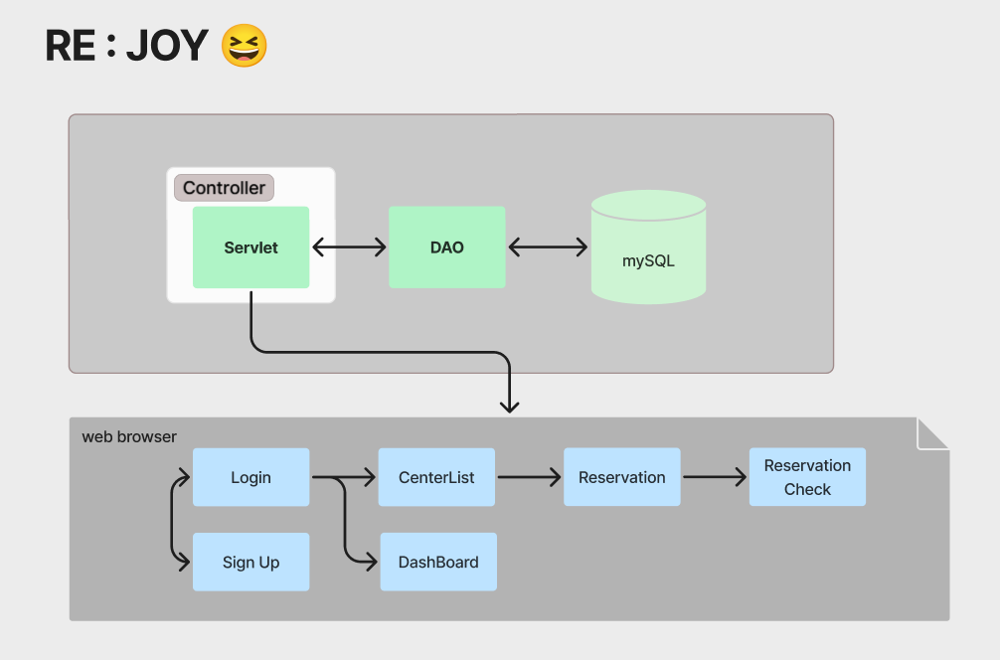
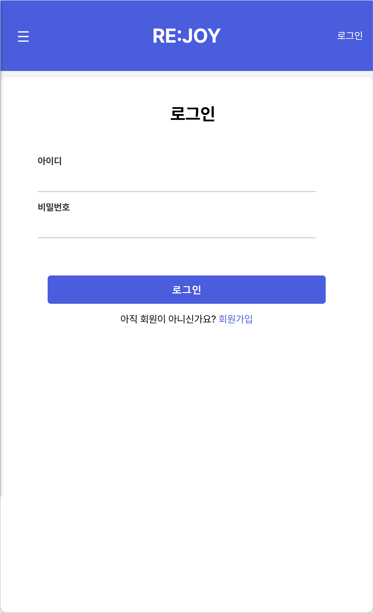
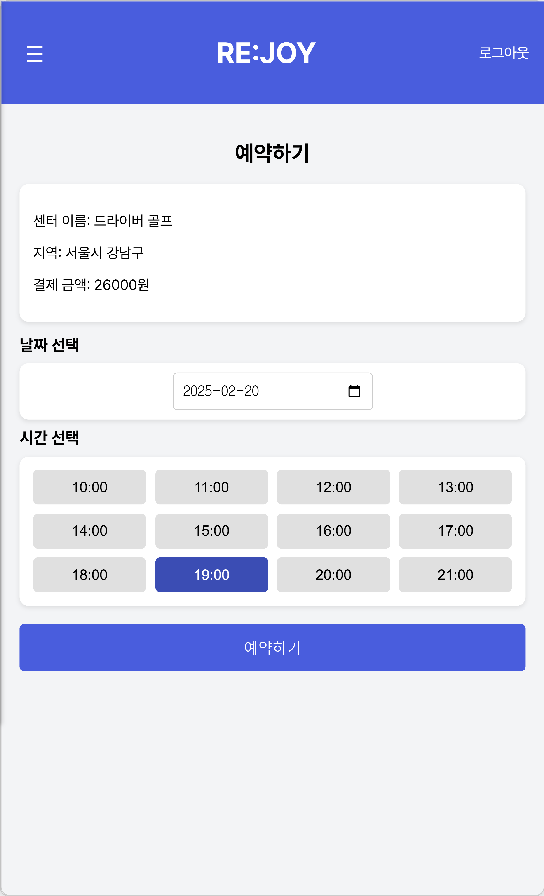
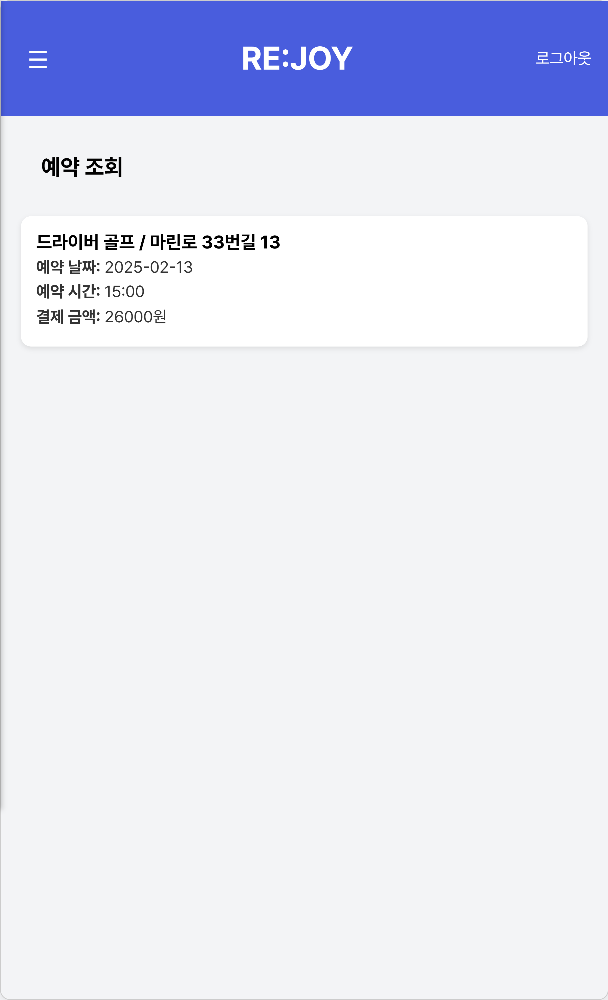
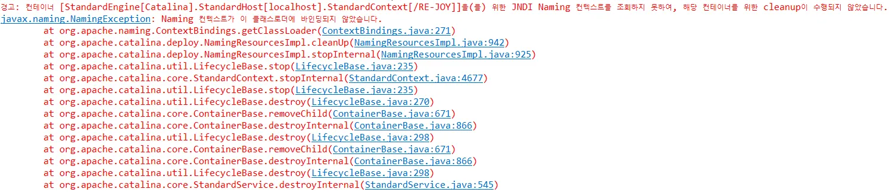

# RE-JOY 🎉

## 1. Team 구구구칠

|||||
|:-:|:-:|:-:|:-:|
|김민성<br/>[@minsung159357](https://github.com/minsung159357)|SeulGi_LEE<br/>[@seulg2027](https://github.com/seulg2027)|HanJH<br/>[@letsgojh0810](https://github.com/letsgojh0810)|구민지<br/>[@minjee83](https://github.com/minjee83)|

## 2. 시장 분석 및 사업 개요

### 👬 타겟 시장

5060세대의 비중이 높아지면서, 실버 세대가 여가 시간을 효율적으로 활용할 수 있는 서비스를 요구하는 주요 사용자층으로 부상하고 있다. 특히, 다양한 취미 활동을 통해 사회적 관계를 확장하고, **개인의 삶의 질을 향상시키고자 하는 욕구**가 커지고 있다고 분석했다.

### 💬 경쟁 분석

기존의 취미 관련 웹 서비스들은 주로 모든 연령대를 타겟으로 하여 일반적인 정보를 제공하고 있어 5060세대 특화 서비스를 찾기 어렵다. 본 서비스는 ELK를 활용한 데이터 분석을 통해 **5060세대의 니즈를 충족시킬 수 있는 경쟁력을 가질 것**으로 예상한다.

<<<<<<< Updated upstream
### 💰 수익화 전략

기본적으로 예약 중개 서비스인만큼 사용자들이 해당 서비스를 이용하여 예약을 할 때 중간에서 수수료를 책정하여 수익을 실현할 수 있을 것으로 기대된다.

=======
>>>>>>> Stashed changes
## 3. Project 주제

💡 기간 : `2025.02.03` ~ `2025.02.10`

💡 프로젝트 명 : RE-JOY <br/>
    
    RE-JOY 의미 : "다시(Re) 즐기자(Joy)!" 🎉
    - 5060 세대가 인생 2막을 즐길 수 있는 취미 예약 플랫폼

💡 개요 : 본 프로젝트는 `Servlet`, `jsp`와 `Apache Tomcat`을 사용하여 사용자들에게 중단되지 않는 편리한 웹 서비스를 제공하는 것을 목표로 한다. 5060세대들이 선호하는 취미 종류를 `ELK(Elasticsearch, Logstash, Kibana) Stack`을 활용하여 분석하고, 선호도가 높은 취미를 검색 시 우선으로 노출시킴으로써 사용자 친화적인 서비스를 제공한다. 아울러, 통계 데이터를 시각화하여 5060세대의 취미 선호도를 한눈에 확인할 수 있도록 구성하였다.

💡 주제 : 5060의 즐거움을 위한 취미 통합 예약 사이트

💡 데이터 출처 : [취미 선호도 데이터](https://www.kosis.kr/index/index.do)를 CSV 파일로 받아서 연령대별, 성별별로 선호도 분석 📈


## 4. Stack & Tools

| Elements       | Tools                        | 설명                         |
|----------------|------------------------------|------------------------------|
| Database   |  | 사용자, 취미 센터, 예약 정보 등 데이터 저장   |
| Server   |    | 각각 WAS 서버, 데이터베이스 서버로 사용 |
| Data Anaysis   |  | 데이터 수집, 검색, 분석 도구 |
| WEB System  |      | 웹 서비스 개발 도구 |


## 5. 기능 소개 및 구현 결과

### ⚒️ 아키텍처 소개



### 🔧 주요 기능


### 📢 구현 결과
✔️ 5060세대들이 핸드폰으로 온라인에 자주 접속하기 때문에, 웹 뷰가 아닌 모바일 뷰로 UI를 구성하였다.

||||
|:-:|:-:|:-:|
|회원가입|로그인|센터리스트조회|
||||
|예약|예약내역조회|통계조회|


## 6. 데이터베이스


4개의 테이블을 만들어 데이터베이스를 제작하였다. [SQL DDL문 보러가기](./sql/ddl.sql)

| Table명       | 설명             | 용도                         |
|----------------|-----------------|------------------------------|
| Users | 사용자 정보 테이블 | 사용자 정보를 저장하는 테이블. 사용자의 나이, 성별을 입력받아 해당 정보를 기반으로 취미 리스트를 보여줌 |
| Schedules | 예약 가능 시간 정보 테이블 | 예약이 가능한 시간대를 저장하는 테이블 |
| Reservation | 예약 정보 테이블 | 사용자가 예약한 정보를 저장하는 테이블 |
| center_info | 취미 센터 테이블 | 취미 센터 정보들을 저장하는 테이블 |


## 7. Trouble Shooting

### 7-1. Servlet을 찾지 못하는 오류
```
심각: 서블릿 [Controller.ReservationController]을(를) 위해 할당하던 중 예외 발생
java.lang.ClassNotFoundException: javax.servlet.http.HttpServlet
```
☑️ 문제 : 특정 Servlet만 Tomcat서버가 인식하지 못하는 문제 <br/><br/>
✅ 해결 : class로 컴파일된 파일들이 생성된 `target/classes` 폴더를 확인해서 해당 class 파일이 없어서 나는 오류임을 발견 -> publish 후 class 파일 생성된 부분 확인하여 WAS 서버 실행

### 7-2. 회원가입 시 패킷 오류


☑️ 문제 : 회원가입 시 패킷이 크다는 오류 발생  <br/><br/>


✅ 해결 : mysql.conf파일에서 max_allowed_packet=64M으로 패킷 크기 수정해봐도 해결이 안됨, 실제로는 환경 설정이 제대로 설정되있지 않아서 생긴 문제임을 확인함

### 7-3. Tomcat server 실행 시 ClassLoader를 바인딩하지 못하는 오류



☑️ 문제 : Tomcat 서버 설정에서 ClassLoader가 바인딩되지 않은 문제 <br/>&emsp;&emsp;&emsp; → Tomcat이 이전 Build의 클래스 파일을 참조하고 있거나, sts 내부 Build 경로가 깨진 상태로 실행될 수 있음<br/><br/>
✅ 해결 : Project를 workspace에서 삭제 후, 다시 import → Tomcat clean → Clean Tomcat Work directory → Project Clean → Update build.gradle → 다시 서버 실행

## 8. Team member's Review
### 💡 구민지
```
프로젝트를 진행하며 환경설정의 중요성을 다시 한번 깨달았다. STS 환경에서 발생한 에러 메시지가 실제 원인을 정확히 나타내지 않는 경우가 있었는데,    
이는 포트 포워딩 설정 오류로 인해 발생한 문제였다. 에러 메시지에는 데이터 패킷 크기 문제로 값이 전달되지 않는다고 나왔지만, 실제 원인은 다른 곳에 있었다. 
또한, GitHub에서 pull 작업을 수행할 때마다 톰캣 서버가 다운되어 프로젝트 진행에 어려움을 겪었고, 이를 통해 환경 설정이 얼마나 중요한지 다시 느꼈다.
MVC 패턴을 활용해 데이터를 JSP에 출력하는 연습을 진행했다. Controller를 통해 페이지 이동을 처리하고, DAO를 사용해 데이터베이스에서 데이터를 
가져오는 구조를 직접 설계하고 구현하며 실습할 수 있었다.
공공데이터를 활용해 Kibana에서 시각화를 구현하기 위해 데이터를 정제하는 작업을 진행했다. 
원하는 결과를 얻기 위해 데이터를 분석하고 가공하는 과정을 거치며 데이터 정제의 중요성을 경험했다. 
```

### 💡 한정현
```
JSP와 Servlet을 사용하여 웹 프로젝트를 하면서 데이터 이동과 DB연동 과정에 대해 자세하게 한번 더 공부할 수 있게 
되어서 좋았다. 다만 협업을 하는 과정에서 DB 설계를 정확하게 해야된다는 것을 깨달았다. UI를 먼저 만들고 그것을 바탕으로 DB 설계를 하면서 프로젝트를 진행하는 것이 중요하다는 것을 알았다. 
또한 현재에는 리스트를 불러올때 필터링이 양이 많지 많아서 하드코딩으로 처리하였는데 이 부분은 추후에 리팩토링을 통해서 동적으로 구현될 수 있게 처리하고 싶다.
```

### 💡 이슬기
```
배운 점으로는 첫째로, 로컬마다 환경이 다르므로 환경설정 파일이나 build.gradle 파일을 팀원들과 합의하여
변경해야한다는 점이다.
둘째로, 이렇게 단기 프로젝트를 할 때면 ERD과 database를 처음부터 잘 짜는 게 정말 중요하다,, 라는 점이다.
아쉬운 점으로는 단기 프로젝트라서 기능 구현이 가장 우선이기 때문에 상대적으로
최적화나 Refactoring 할 시간이 부족해서
시도하기 어렵다는 점이다.
```

### 💡 김민성
```
이번 프로젝트를 통해 초기 설계 단계와 개발 환경 통일이 매우 매우 중요하다는 것을 느꼈다.
개발 환경을 통일하지 않은 채로 개발을 진행하다보니 깃허브를 이용할때마다 서로 충돌이 많이 나서 개발 시간보다 충돌 오류 해결에 시간을 더 쏟았던 것 같다.
결국 명확한 해결방법을 찾지 못한 것이 아쉬웠다.
또한 초기 설계 단계에서 사용자 관점에서 어떤 기능을 어디까지 구현할지, 누가 어떤 기능을 맡아서 구현할지, DB 부분에서 테이블명, 데이터들의 타입, 컬럼명을 명확하게 정하지 않고 개발을 시작해서 여러 문제가 생겼던 것 같다.
```
